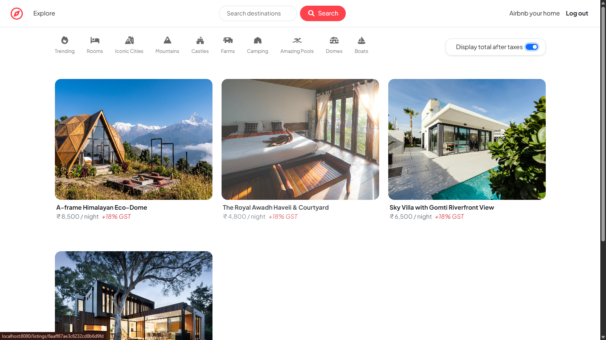
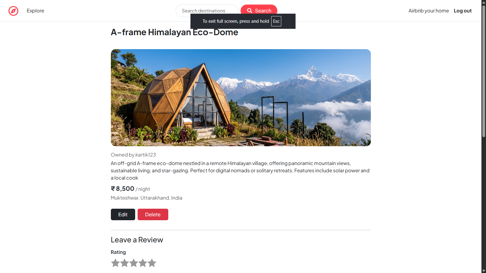
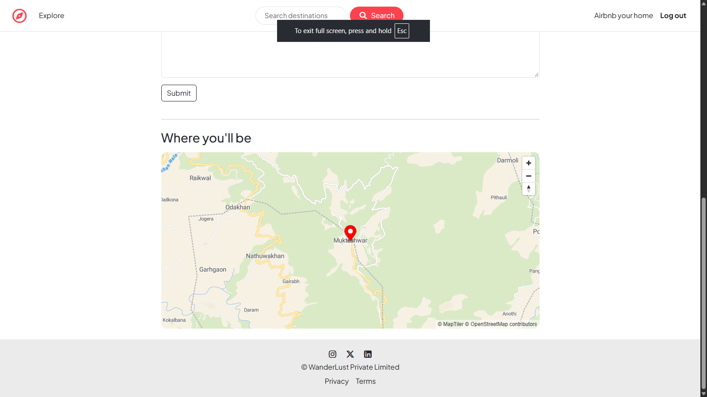

# 🧭 WanderLust

A full-stack vacation rental platform inspired by Airbnb.

### 📸 Project Preview

<table>
  <tr>
    <td colspan="2"></td>
  </tr>
  <tr>
    <td width="50%"></td>
    <td width="50%"></td>
  </tr>
</table>

### Tech Stack
- **Frontend:** EJS, Bootstrap 5, MapLibre GL
- **Backend:** Node.js, Express.js
- **Database:** MongoDB (Mongoose)
- **Services:** Cloudinary, Render